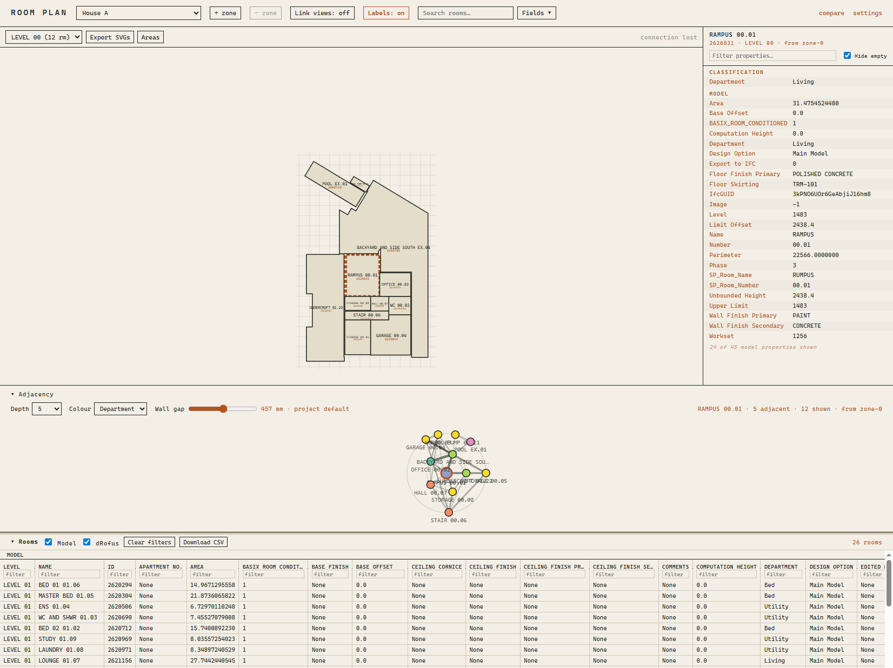

# RoomMate

Revit model data → a Rust server → a browser floor-plan viewer. **Five
entities** — rooms, doors, windows, FF&E and spaces — are extracted from Revit,
pushed as a versioned JSON contract, joined against external reference data
(dRofus is the common one; the pipeline is keyed on N sources), classified into
a project's own hierarchy, and served to a viewer that draws plans, aggregates
areas, reconciles each entity against the model and graphs which rooms share a
wall.



**Start with [docs/](docs) — [Architecture & Strategy](docs/STRATEGY.md) is the
index.** The design rationale lives there, not here; this file is orientation
only.

## Layout

The top level maps to the pipeline, so where a thing lives tells you which stage
it belongs to:

| | |
|---|---|
| [`extractor/`](extractor) | The **producer**. `pyRevit/` holds the IronPython that runs inside Revit and pushes to the server. |
| [`src/`](src) | The **Rust server** — ingest, storage, the reference join, classification, and the geometry services (`areas`, `adjacency`, `room_locator`). Two binaries: the axum HTTP server and an MCP server over the same read logic. |
| [`static/`](static) | The **browser viewer** — HTML/CSS/JS served as-is, plus `vendor/renderer.bundle.js`, which is **generated and committed** so a fresh clone runs with no node installed. |
| [`src-js/`](src-js) | The viewer's **WebGL plan renderer** — TypeScript, built by Vite into `static/vendor/`. Where new frontend code lands; see [Coding Conventions](docs/CODING-CONVENTIONS.md). |
| [`settings/`](settings) | Server config, and one TOML per project (classification tiers, sources, area policy). |
| [`scripts/`](scripts) | Dev tooling run *against* this repo: fixture generators, `fixtures/` (sample data to push or upload), `check_areas.py` (the areas diagnostic), `weekly_review.py` (the docs-vs-code drift check), `module_stats.py` (measures the module plan's cells; `--check` reports drift), and the `probe_*`/`analyse_*` pairs that settle an entity's open questions before it is built. Not shipped. |
| [`docs/`](docs) | Strategy docs, coding conventions, and handovers (landed ones in `docs/Superseded/`). |
| [`installer/`](installer) | The **Windows package** — an Inno Setup script and the launcher the Start Menu shortcut runs, producing one `RoomMate-Setup.exe` with no prerequisites. See [installer/README.md](installer/README.md). |

## The extractor and the server move together

`extractor/` and `src/` share one versioned wire contract, and the rule is
stated there: **update the extractor and the server together — there is no
transition window.** A producer on the wrong version is rejected loudly rather
than silently misparsed. Each entity carries its own version, all under
[`src/contract/`](src/contract): rooms are at `SUPPORTED_SCHEMA` (v7), and doors,
windows, FF&E and spaces each have their own constant beside it.

That is the reason the extractor lives in this repo rather than beside the other
Revit tooling: a contract change becomes one commit instead of two repos
drifting. The cost of *not* having it here is on record — `room_boundary` was
added to the upload envelope, and the server accepted, resolved and echoed it,
while nothing sent it: for as long as the two halves sat apart, every model fell
back to a *guessed* boundary regime. Closing that was a handful of lines on the
producer once both halves were in one place. See
[Area calculation](docs/STRATEGY-AREA-CALCULATION.md).

Two constraints follow from where the extractor runs:

- **IronPython 2.7, inside Revit** — not CPython 3. Modern syntax and most
  linters do not apply, which is also why it does not live in `scripts/`.
- **CI does not cover it.** `.github/workflows/rust.yml` builds and tests the
  Rust crate only; there is no Python check. Changes there are verified by
  running them against a real model.
- **Its pyRevit buttons live outside this repository, over a *copy* of
  `extractor/pyRevit/room_m`.** So a change here is inert until it is copied
  there, and nothing checks the two are in step — `diff -rq` between them is the
  only check there is.

## Running it

```bash
cargo run -- --server-settings settings/server.toml --project-settings settings/projects
```

Serves the viewer and the API on `http://127.0.0.1:5151` (`--port`, or `$PORT`,
moves it; the host is loopback-only by design — see `DEFAULT_HTTP_HOST`).
[Server](docs/STRATEGY-SERVER.md) covers the endpoints,
[Browser](docs/STRATEGY-BROWSER.md) the viewer.

`static/` is found **beside the executable**, falling back to the working
directory — which is what the line above relies on. See `main.rs`'s
`viewer_root` before moving either.

## Installing it

For a machine that is not a development one, [`installer/`](installer) builds a
single `RoomMate-Setup-<version>.exe`: both binaries, the viewer, and a seeded
per-user data folder, with no Rust, node or runtime to install first.

```powershell
winget install JRSoftware.InnoSetup   # build machine only, once
.\installer\build.ps1
```

It installs per-user (no admin), keeps the app under
`%LOCALAPPDATA%\Programs\RoomMate` and everything writable — settings and the
snapshot store — under `%LOCALAPPDATA%\RoomMate`, so an upgrade never touches
an edited project file. [installer/README.md](installer/README.md) has the
reasoning.
